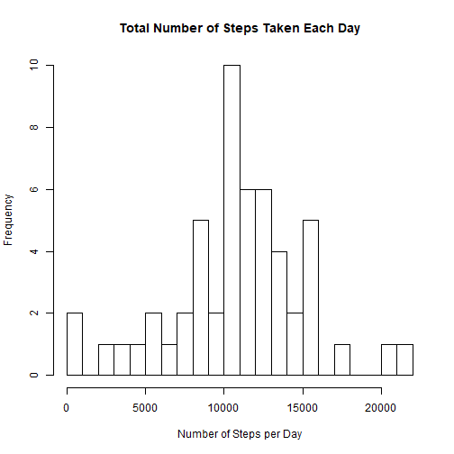
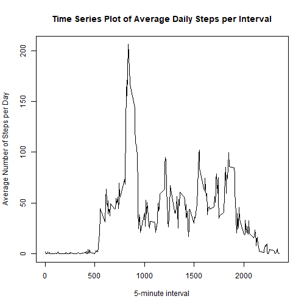
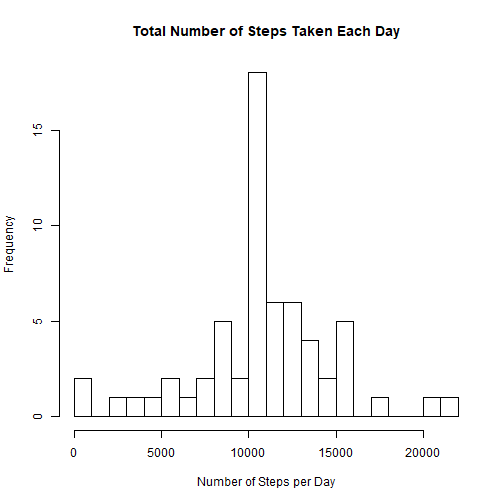
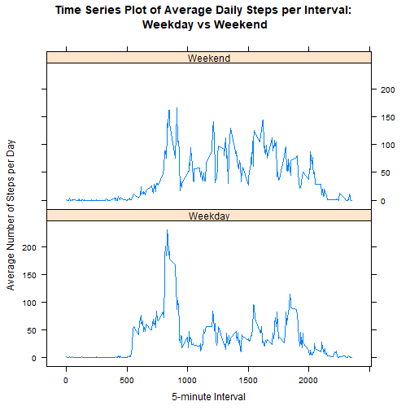

Coursera-Reproducible-Research-Week2-Course-Work
=================================================

### Loading/Preprocessing the dataset

Unzip source file and then read the dataset into R.  
*You can download the data [here](https://github.com/shueyan098/RepData_PeerAssessment1/blob/master/activity.zip).* 


```r
unzip("repdata_data_activity.zip")
Activity <- read.csv("activity.csv", header = TRUE, na.strings = "NA")
```

Take a look the activity dataset.

```r
str(Activity)
```

```
## 'data.frame':	17568 obs. of  3 variables:
##  $ steps   : int  NA NA NA NA NA NA NA NA NA NA ...
##  $ date    : Factor w/ 61 levels "2012-10-01","2012-10-02",..: 1 1 1 1 1 1 1 1 1 1 ...
##  $ interval: int  0 5 10 15 20 25 30 35 40 45 ...
```

Transform Date column to standard date format to suit the analysis.

```r
Activity$date <- as.Date(as.character(Activity$date, "%Y-%m-%d"))
str(Activity)
```

```
## 'data.frame':	17568 obs. of  3 variables:
##  $ steps   : int  NA NA NA NA NA NA NA NA NA NA ...
##  $ date    : Date, format: "2012-10-01" "2012-10-01" ...
##  $ interval: int  0 5 10 15 20 25 30 35 40 45 ...
```

Now, the data seems good to proceed.


### What is mean total number of steps taken per day?

Calculate the total number of steps for each day. Missing values of steps can be ignored. 

```r
library(dplyr)
DailySteps <- 
    filter(Activity, !is.na(steps)) %>%
    group_by(date) %>% 
    summarise(totalsteps = sum(steps))
```

Here is the data. 

```r
head(DailySteps)
```

```
## # A tibble: 6 x 2
##   date       totalsteps
##   <date>          <int>
## 1 2012-10-02        126
## 2 2012-10-03      11352
## 3 2012-10-04      12116
## 4 2012-10-05      13294
## 5 2012-10-06      15420
## 6 2012-10-07      11015
```

Let's make a histogram of the total number of steps taken each day.

```r
hist(DailySteps$totalsteps, data = DailySteps, 
     xlab = "Number of Steps per Day", 
     main = "Total Number of Steps Taken Each Day",
     breaks = 20
)
```




```r
Mean.DailySteps <- as.integer(mean(DailySteps$totalsteps))
Median.DailySteps <- median(DailySteps$totalsteps)
```

The **mean** and **median** total number of steps taken per day are **10766** and 
**10765** respectively.


### What is the average daily activity pattern?

Calculate the average number of steps per interval (averaged across all days).

```r
AverageSteps <- 
    filter(Activity, !is.na(steps)) %>%
    group_by(interval) %>%
    summarise(average = mean(steps))

head(AverageSteps) 
```

```
## # A tibble: 6 x 2
##   interval average
##      <int>   <dbl>
## 1        0  1.72  
## 2        5  0.340 
## 3       10  0.132 
## 4       15  0.151 
## 5       20  0.0755
## 6       25  2.09
```

Make a time series plot of the 5-minute interval and the average number of steps.

```r
plot(AverageSteps$interval, AverageSteps$average, data = AverageSteps,
     type = "l",
     xlab = "5-minute interval",
     ylab = "Average Number of Steps per Day",
     main = "Time Series Plot of Average Daily Steps per Interval"
)
```



Which 5-minute interval, contains the maximum average of steps?

```r
MaxInterval.AverageSteps <- as.integer(AverageSteps[which.max(AverageSteps$average),"interval"])
MaxSteps.AverageSteps <- as.integer(AverageSteps[which.max(AverageSteps$average),"average"])
```

Interval **835** has the maximum average of steps of **206**.

### Imputing missing values

Note that there are a number of days/intervals where there are missing values (coded as NA). The presence of missing days may introduce bias into some calculations or summaries of the data.


```r
missing <- sum(is.na(Activity$steps))
```

There are **2304** missing values in the dataset.

Here we are filling in missing value with the mean of steps for that 5-minute interval.

```r
NewActivity <- 
    merge(Activity, AverageSteps, "interval") %>% 
    mutate(steps = ifelse(is.na(steps),average, steps), average = NULL)

head(NewActivity)
```

```
##   interval    steps       date
## 1        0 1.716981 2012-10-01
## 2        0 0.000000 2012-11-23
## 3        0 0.000000 2012-10-28
## 4        0 0.000000 2012-11-06
## 5        0 0.000000 2012-11-24
## 6        0 0.000000 2012-11-15
```

Take a look at the new dataset, it can be seen that the rows with NA have been filled with mean values.

Now, calculate the total number of steps for each day again and make a histogram of it.

```r
NewDailySteps <- 
    filter(NewActivity, !is.na(steps)) %>%
    group_by(date) %>% 
    summarise(totalsteps = sum(steps))

hist(NewDailySteps$totalsteps, data = NewDailySteps, 
     xlab = "Number of Steps per Day", 
     main = "Total Number of Steps Taken Each Day",
     breaks = 20
)
```



Calculate the mean and median total number of steps taken per day again.

```r
Mean.NewDailySteps <- as.integer(mean(NewDailySteps$totalsteps))
Median.NewDailySteps <- as.integer(median(NewDailySteps$totalsteps))
```

The **mean** and **median** now are **10766** and **10766** respectively.

There is no difference between the mean before and after missing value imputing, meanwhile the median after the imputing has been increased by 1, as compared to prior. 

Before imputing  

* mean - **10766**  
* median - **10765**  

After imputing  

* mean - **10766**  
* median - **10766**

Let's see if there is any impact on the estimates of the total daily number of steps.

```r
TotalSteps <- as.integer(sum(Activity$steps, na.rm = TRUE))
NewTotalSteps <- as.integer(sum(NewActivity$steps))
```

Before imputing  

* TotalSteps - **570608**  

After imputing  

* NewTotalSteps - **656737**  


It can be seen that after imputing missing data, the total number of steps has been increased by **15%**, from 570608 to 656737.

### Are there differences in activity patterns between weekdays and weekends?

Create a new factor variable in the dataset with two levels - "weekday" and "weekend".

```r
NewActivity$day <- ifelse(weekdays(NewActivity$date) %in% c("Sunday","Saturday"), "Weekend", "Weekday")
str(NewActivity)
```

```
## 'data.frame':	17568 obs. of  4 variables:
##  $ interval: int  0 0 0 0 0 0 0 0 0 0 ...
##  $ steps   : num  1.72 0 0 0 0 ...
##  $ date    : Date, format: "2012-10-01" "2012-11-23" ...
##  $ day     : chr  "Weekday" "Weekday" "Weekend" "Weekday" ...
```

Calculate the average number of steps taken, averaged across all weekday days or weekend days.

```r
NewAverageSteps <- 
    group_by(NewActivity, interval, day) %>%
    summarise(average = mean(steps))

head(NewAverageSteps)
```

```
## # A tibble: 6 x 3
## # Groups:   interval [3]
##   interval day     average
##      <int> <chr>     <dbl>
## 1        0 Weekday  2.25  
## 2        0 Weekend  0.215 
## 3        5 Weekday  0.445 
## 4        5 Weekend  0.0425
## 5       10 Weekday  0.173 
## 6       10 Weekend  0.0165
```

Make a time series plot of the 5-minute interval and the average number of steps taken, averaged across all weekday days or weekend days.

```r
library(lattice)
xyplot(average~interval | day, data = NewAverageSteps,
    type = "l",
    layout = c(1,2),
    xlab = "5-minute Interval",
    ylab = "Average Number of Steps per Day",
    main = "Time Series Plot of Average Daily Steps per Interval: \nWeekday vs Weekend"
)
```




